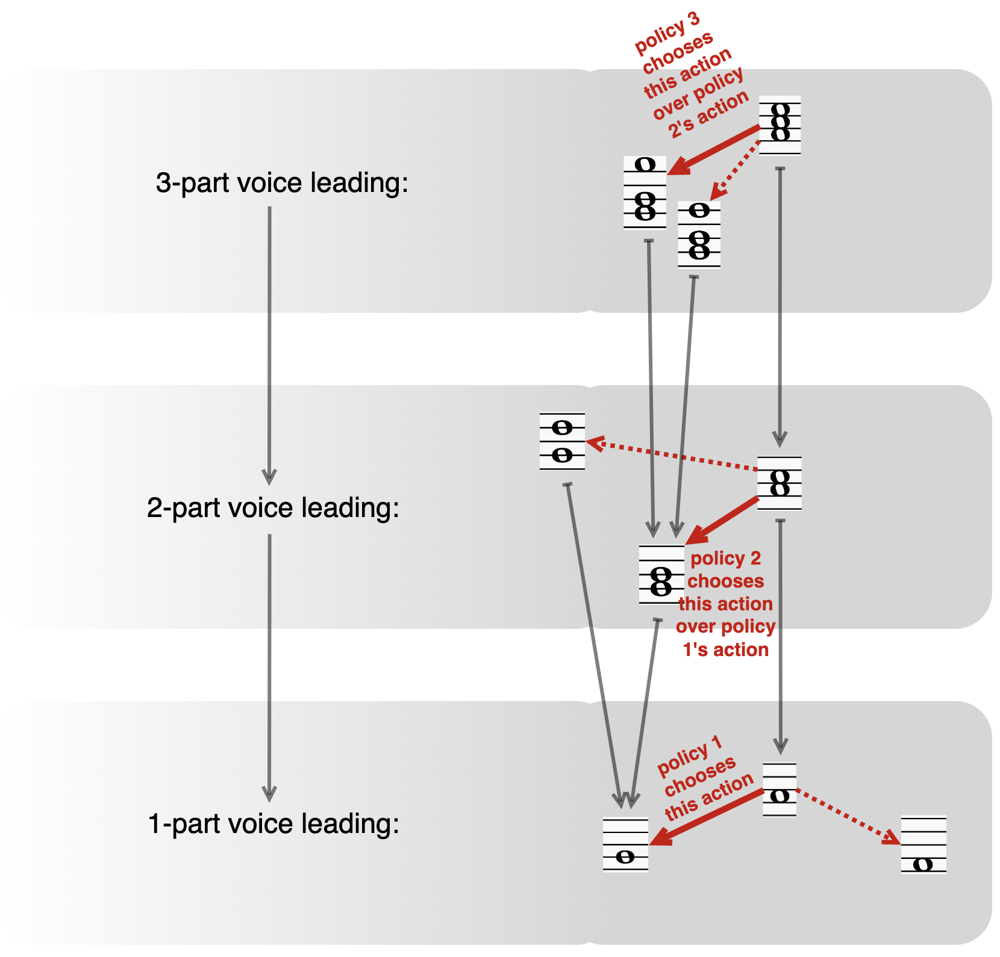

<picture>
  <source media="(prefers-color-scheme: dark)" srcset="assets/rules/images/triadic_dark.png">
  <source media="(prefers-color-scheme: light)" srcset="assets/rules/images/triadic_light.png">
  
</picture>

# RL Counterpoint

**Project Owner (PO):** Tyler Foster

`rl_counterpoint` is a research repo for [reinforcement learning](https://en.wikipedia.org/wiki/Reinforcement_learning) based [counterpoint](https://en.wikipedia.org/wiki/Counterpoint) generation. The long-term goal is to train an RL agent, equipped with a tranformer-driven policy function, to generate "good" counterpoint passages, and to be able to modify the flavor/feel/vibe of these voiceleading passages by modifying the agent's reward functions.

The repo currently contains two systems:

1. [`rl_counterpoint/`](/rl_counterpoint/): the legacy flat-graph project, kept as a frozen reference and baseline
2. [`tower/`](/tower/): the active hierarchical redesign, where training proceeds rank by rank through a tower of graph problems

Right now, `tower` is the central product in this repo.


## Key PO Design & Engineering Insights

### **INSIGHT 1:** *The book [Tonal Counterpoint for the 21st-Century Musician](https://www.bloomsbury.com/us/tonal-counterpoint-for-the-21stcentury-musician-9781442234598/) is accidentially written for RL training pipelines.*
One of the most useful desgin discoveries made by the PO in this repo is that the music textbook [Tonal Counterpoint for the 21st-Century Musician (TC21M)](https://www.bloomsbury.com/us/tonal-counterpoint-for-the-21stcentury-musician-9781442234598/) is , accidentally, a very good specification source for reward design. Its rules already come in the right shape for reinforcement learning:
- local motion preferences
- recovery and resolution patterns over time
- beat-sensitive structural rules
- cadential success templates
- hard voiceleading prohibitions

In other words, the book naturally separates musical behavior into the same kinds of objects an RL system needs to reason about. That said, the repo does **not** treat the book as executable code in prose form. The engineering pattern weve used designing and developing the present repo is:

1. Extract the musical rules into a structured note set:
    - *Notes summarizing TC21M*: [`assets/rules/tc21m_rules.md`](assets/rules/tc21m_rules.md)
2. Map those rules into computational categories:
    - *Reward spec*: [`docs/design/tower/rank_local_reward_spec.md`](/docs/design/tower/rank_local_reward_spec.md) 
    -  *Initiates reward probe artifacts*: [`scripts/tower_reward_probe.py`](/scripts/tower_reward_probe.py)
3. Preserve a stable reward protocol boundary:
    - *Environment interface contract*: [`rl_counterpoint/reward/protocol.py`](/rl_counterpoint/reward/protocol.py)
    - *Reward context contracts*: [`tower/reward/context.py`](/tower/reward/context.py)
    - *Structured reward outputs*: [`tower/reward/result.py`](/tower/reward/result.py)
4. Implement narrow, testable reward slices rather than trying to import the whole grammar at once:
    - *Tower training entrypoint (rank-1)*: [`scripts/tower_train.py`](/scripts/tower_train.py)
    - *Rank-2 training entrypoint*: [`scripts/tower_train_rank2.py`](/scripts/tower_train_rank2.py)
    - *Rank-3 training entrypoint*: [`scripts/tower_train_rank3.py`](/scripts/tower_train_rank3.py)
    - *Reward probe artifacts*: [`scripts/tower_reward_probe.py`](/scripts/tower_reward_probe.py)

This approach lets the project use a real contrapuntal reference manual without blocking all infrastructure work on perfect music theory formalization up front. The book provides one particular vocabulary of something like an informal spec for what should matter musically in Western counterpoint, and then the present repo turns that vocabulary into reward terms, pruning rules, and cadence logic that can all be implemented in small executable pieces.

### **INSIGHT 2.** *Counterpoint is naturally a problem in [Hierarchical RL](https://arxiv.org/pdf/2506.14045).*
The ***second*** key technical insigth about how to do this that we implement in the present repo is that:
> The probelm of generating counterpoint passages is naturally hierarchical. For instance, 3-part voiceleading naturally reduces to an inner-voice problem *over* a simpler 2-part voice leading problem, itself natrually reducing to an upper-voice problem *over* a simpler 1-voice pedal problem.

From an engineering perspective, this means our agent should actually be a composite agent, formed from a hierarchical system of individual agents with interrelated but separate policy models, trained as follows:
  - *Rank-1 agent*: Learn how to generate a good pedal line
  - *Rank-2 agent*: Add the top voice over a frozen rank-1 (pedal) scaffold
  - *Rank-3+ agents*: Add further interior voices over lower-rank scaffolds and under upper-voice.

  <picture>
    <source media="(prefers-color-scheme: dark)" srcset="assets/images/hrl_dark.png">
    <source media="(prefers-color-scheme: light)" srcset="assets/images/hrl_light.png">
    
  </picture>

The design lives in [`tower/`](/tower/) and is documented in [`docs/design/tower/`](/docs/design/tower/).


## Current Project Status

### Legacy system: [`rl_counterpoint/`](/rl_counterpoint/)

This subproject is frozen. It still matters because it provides:

- the original flat graph and environment baseline
- reward and rollout reference behavior
- legacy transformer-policy training code
- tests and scripts that still anchor older functionality

You should think of it as historical ground truth, not the active destination.

### Active system: [`tower/`](/tower/)

This is the current build target. It already includes:

- tower graph specs and action/state conventions
- transformer policies over frontier-window observations
- artifact-backed rank-local training runs
- staged rank-1 training
- rank-2 training over accepted rank-1 parent checkpoints
- staged rank-2 training
- rank-3 training over frozen lower-rank parent scaffolds
- reward diagnostics, checkpoints, metrics, and MIDI artifact writing
- final-rank-aware lower-tier graph rebuilding for the active tower
- tests covering graph, reward, rollout, runner, scripts, and protocol behavior

Implemented slices are still intentionally incomplete from a musical point of view, but the engineering substrate is real and actively used.

## Repo Layout

```text
rl_counterpoint/
├── rl_counterpoint/          legacy flat-system code
├── tower/                    active hierarchical redesign
├── scripts/                  training, smoke, and probing entrypoints
├── tests/                    automated test coverage
├── docs/                     design docs, continuity reports, directives
├── artifacts/                generated run outputs
├── assets/                   repo media assets
├── pyproject.toml
└── README.md
```

### Active [`tower/`](/tower/) package

```text
tower/
├── action/                   rank-local action objects and helpers
├── graph/                    graph specs, legality, and lift/projection logic
├── music/                    pitch and music-theory utilities
├── policy/                   transformer policies and samplers
├── reward/                   rank-local reward terms and factories
└── train/                    rollout, losses, checkpointing, runners
```

### Key scripts

- [`scripts/tower_train.py`](/scripts/tower_train.py)
  - single rank-1 training run
- [`scripts/tower_train_staged.py`](/scripts/tower_train_staged.py)
  - staged rank-1 curriculum, typically coupled start/target then decoupled continuation
- [`scripts/tower_train_rank2.py`](/scripts/tower_train_rank2.py)
  - rank-2 training against an accepted rank-1 parent checkpoint
- [`scripts/tower_train_rank2_staged.py`](/scripts/tower_train_rank2_staged.py)
  - staged rank-2 curriculum
- [`scripts/tower_train_rank3.py`](/scripts/tower_train_rank3.py)
  - rank-3 training against a frozen lower-rank parent stack
- [`scripts/tower_reward_probe.py`](/scripts/tower_reward_probe.py)
  - quick reward probing for tower slices
- [`scripts/train_reinforce.py`](/scripts/train_reinforce.py)
  - legacy flat-system training entrypoint
- [`scripts/smoke_*.py`](/scripts/smoke_*.py)
  - small sanity scripts for the legacy baseline

## Installation

This repo uses `uv`.

```bash
uv sync
```

Run the full test suite:

```bash
uv run pytest
```

## Training Workflows

### Legacy flat-system training

```bash
uv run python scripts/train_reinforce.py
```

### Rank-1 tower training

Single run:

```bash
uv run python scripts/tower_train.py --rank 1 --episodes 1000
```

Staged curriculum:

```bash
uv run python scripts/tower_train_staged.py \
  --lineage-id my-rank1-lineage \
  --stage1-episodes 5000 \
  --stage2-episodes 5000
```

### Rank-2 tower training

This assumes the lineage already has an accepted rank-1 checkpoint.

```bash
uv run python scripts/tower_train_rank2.py \
  --lineage-id my-rank1-lineage \
  --episodes 5000
```

Staged curriculum:

```bash
uv run python scripts/tower_train_rank2_staged.py \
  --lineage-id my-rank2-lineage \
  --stage1-episodes 5000 \
  --stage2-episodes 5000
```

### Rank-3 tower training

This assumes the lineage already has an accepted lower-rank parent stack.

```bash
uv run python scripts/tower_train_rank3.py \
  --lineage-id my-rank2-lineage \
  --episodes 5000
```

## Artifacts

Training runs write under `artifacts/`.

Typical tower lineage layout:

```text
artifacts/tower/<lineage-id>-stage1/rank_1/
artifacts/tower/<lineage-id>/rank_1/
artifacts/tower/<lineage-id>/rank_2/
artifacts/tower/<lineage-id>/rank_3/
```

Common outputs include:

- `config.json`
- `metrics.jsonl`
- `checkpoint_latest.pt`
- `reward_diagnostics.jsonl` when enabled
- `example_episode.mid` and additional final inference MIDI files
- lineage manifests and rank manifests

## Documentation

The repo has a lot of project memory in [`docs/`](/docs/).

Most important folders:

- [`docs/design/tower/`](/docs/design/tower/)
  - system design, rollout semantics, training protocol, reward contracts, build plans
- [`docs/engineer_continuity/`](/docs/engineer_continuity/)
  - session handoff reports and implementation continuity
- [`docs/prime_directive/`](/docs/prime_directive/)
  - operating instructions for the engineering agent working in this repo

Good starting points:

- [docs/design/tower/README.md](/docs/design/tower/README.md)
- [docs/design/tower/system_design.md](/docs/design/tower/system_design.md)
- [docs/design/tower/training_protocol.md](/docs/design/tower/training_protocol.md)
- [docs/design/tower/post_slice_8_phase_stage_action_plan.md](/docs/design/tower/post_slice_8_phase_stage_action_plan.md)

## Development Notes

- Python requirement: `>=3.13`
- dependencies live in [pyproject.toml](/pyproject.toml)
- pytest uses `--import-mode=importlib` to avoid duplicate test-module name collisions
- artifact directories can get large during training; long runs often disable training reward diagnostics to keep disk usage sane

