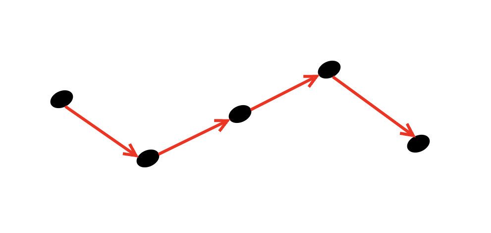
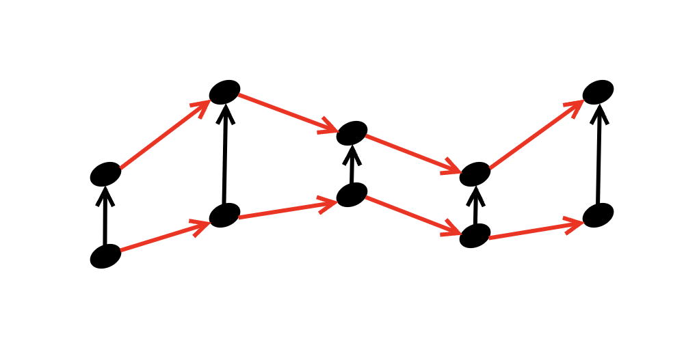
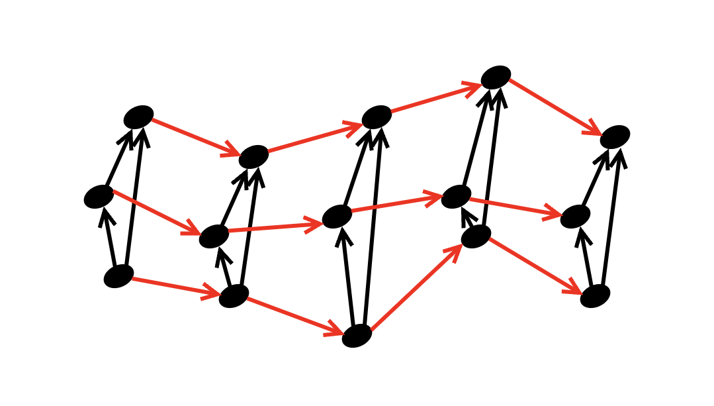
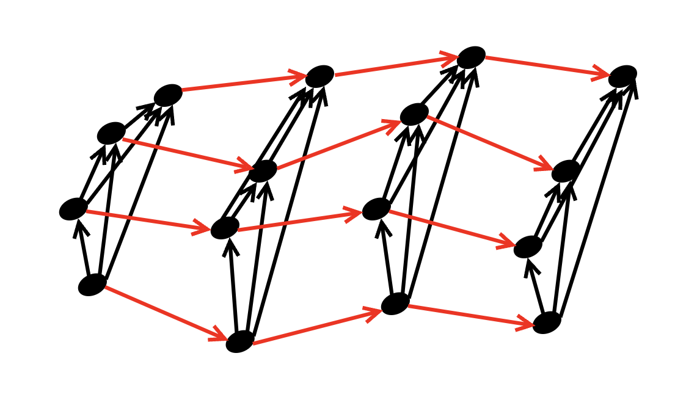

# Counterpoint rules & guidelines
The following rules come form the book [*Tonal Counterpoint for the 21st-Century Musician*]() by Teresa Davidian.

***[FIX THIS...]*** The basic pattern here is that the *$n^{\text{th}}$-species* means "counterpoint for $n+1$ voices. The shift in indices here is actually convenient from a combinatorial/categorical perspective, because it means the system of possible relationsips in $n^{\text{th}}$-species is represented by an $n$-simplex:
## $0^{\text{th}}$-species: the lone singer, ie.., a *melody*

  <picture>
    <source media="(prefers-color-scheme: dark)" srcset="images/1st_species_dark.png">
    <source media="(prefers-color-scheme: light)" srcset="images/1st_species_light.png">
    
  </picture>

### Single jumps
- Intervals should be, *most often*, **consonant**. Specifically, they should come from the set $$\{\text{m3},\;\text{M3},\;\text{P4},\;\text{P5},\;\text{M6},\;\text{P8}\}.$$
- Dissonany intervals should be used sparingly. These are the intervals $$\{\text{m2},\;\text{M2},\;\text{A4/d5},\;\text{m6},\;\text{m7},\;\text{M7}\}.$$
  - Diminished and augmented intervals need to be subsequently "resolved" by moving up or down a single scale degree
  - 7ths and also large consonant jumps should be subsequently moved in the opposite direction, with a kind of switchback.
### Consecutive jumps
- Avoid jumps that give the "recent" melody a range of more than an octave.
- Avoid consecutive 4ths and 5ths.
### Steps and jumps
- Follow large leaps with *small* step in opposite direction.
- Avoid stepwise motion followed by a leap in the opposite direction.
### Scale
- Give emphasis to the tonic scale degree.
- Shape the melodic line around structural pitches.
  - Put structural pitches at stronger beats
  - Avoid putting unstable scale degrees at stronger beats.
- In ascending context, resolve the leading tone (7th) to tonic as quickly as possible.
### Range
- When moving in one direction, up or down, do not expose unstable intervals such as a $\text{A4}/\text{d5}$ or 7th.
- Use V-I cadence at end of passage.
## $1^{\text{st}}$-species: simple accompaniment, i.e., a *duo*

  <picture>
    <source media="(prefers-color-scheme: dark)" srcset="images/2nd_species_dark.png">
    <source media="(prefers-color-scheme: light)" srcset="images/2nd_species_light.png">
    
  </picture>

### Melodic motion
- Use a variety of parallel, similar, and contrary motion.
- Avoid *oblique* motion, that is, motion where one voice moves but the other is stationary.
- Avoid "immediate" (how immediate?) repetiion of chords and notes.
### Vertical intervals
- Use only consonances for outer intervals in chord (in $1^{\text{st}}$-species, this is whole chord).
- Common occurances in vertical intervals:
  - $\text{P8}$ over tonic at beginning or end of phrase
  - $\text{P5}$ over dominant pitches at or near beginning or end of phrase.
  - $\text{P8}$ can appear over dominant approximately midway through phrase, surrounded by $3$s and $6$s.
## $2$-simplices: three's a crowd, ie., a *trio*

  <picture>
    <source media="(prefers-color-scheme: dark)" srcset="images/triadic_dark.png">
    <source media="(prefers-color-scheme: light)" srcset="images/triadic_light.png">
    
  </picture>

## $3$-simplices: the barber shop *quartet*

  <picture>
    <source media="(prefers-color-scheme: dark)" srcset="images/tetra_dark.png">
    <source media="(prefers-color-scheme: light)" srcset="images/tetra_light.png">
    
  </picture>

## $n$-simplices'