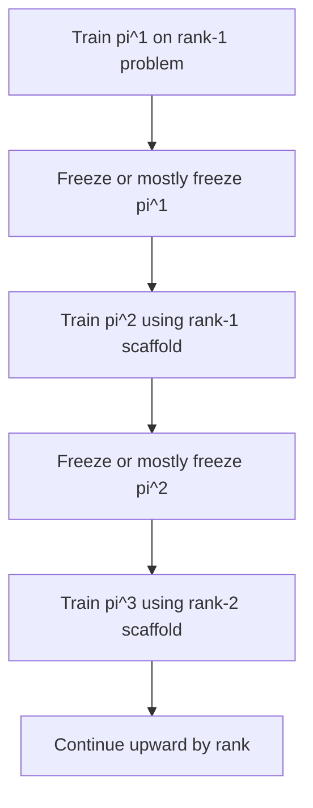
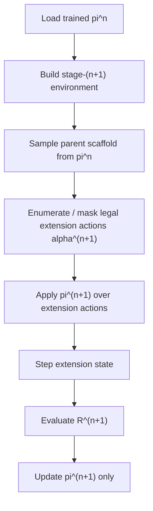
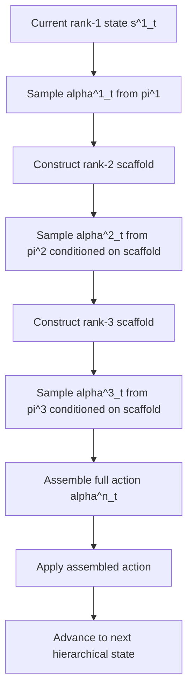
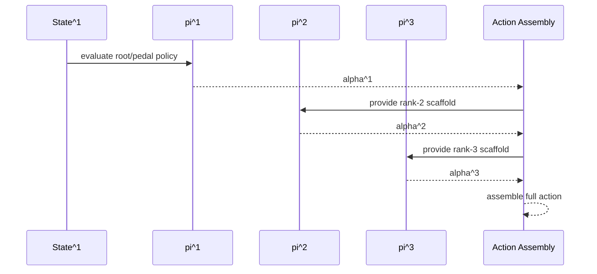

# Tower System Design

## Purpose

This document defines the proposed tower-based redesign of `rl_counterpoint`.

## Attribution

The core tower-design ideas documented here originate with the project manager.

This includes:

- the nested-graph view across chord size
- the requirement that the cross-rank maps are full graph morphisms
- the rule that valid higher-rank voice leadings must project to valid lower-rank voice leadings
- the observation that voiceleading itself builds upward in rank, so that one-part voiceleading is genuinely part of two-part voiceleading, two-part is part of three-part, and so on
- the asymmetry "states project downward, actions assemble upward"
- the semidirect / HNSW-like way of thinking about the structure
- the expectation that this hierarchy creates a major training/search speedup
- the dimensionality insight that if out-degree is treated as a proxy for local search dimension, then reducing the problem tier by tier radically reduces the effective dimension of the searched space
- the idea that higher-rank extensions/sections should become easy to construct once lower-rank scaffolds are already in place

This document is a technical elaboration of those ideas for system design.

It is intentionally more detailed than the migration map. The migration map answers:

- what from the old system should stay
- what should be refactored
- what should be replaced

This document answers:

- what the new system *is*
- what its core objects are
- how control flows through training and inference
- how rank-by-rank policy growth is supposed to work

The central design goal is:

> Make the system inductively trainable on chord size.

That means:

- a 1-part system should train first
- a 2-part system should build on the 1-part system
- a 3-part system should build on the 2-part system
- and so on

The tower should not just support multiple chord sizes. It should make higher chord sizes into extensions of lower chord sizes.

This is not merely a software convenience.

It reflects the project manager's deeper musical observation that voiceleading builds:

- one-voice voiceleading is part of two-voice voiceleading
- two-voice voiceleading is part of three-voice voiceleading
- and so on

The tower is intended to mirror that musical fact structurally.

---

## Executive Summary

The new system is organized around a tower of graph-like state/action problems:

```text
... -> G(3)_bullet -> G(2)_bullet -> G(1)_bullet
```

with the following asymmetry:

- **states project downward**
- **actions assemble upward**

More precisely:

- the downward maps are not merely maps on node sets
- they are intended to be graph morphisms

So if:

$$
\mathrm{pr}^{n+1 \to n} : G(n+1)_\bullet \to G(n)_\bullet
$$

is the stage projection, then a valid higher-rank voice leading must project to a valid lower-rank voice leading.

This is not just a formal nicety.

It is the key structural reason the project manager expects the tower to produce a major training/search speedup.

The intuition is:

- the flat system searches one large high-branching graph directly
- the tower system searches through a hierarchy of valid coarser-to-finer graphs
- because higher-rank validity must respect lower-rank validity, the system can reuse lower-rank search/training structure instead of rediscovering it from scratch

Another way to say the same thing, using the project manager's dimensionality observation, is:

- if local out-degree is treated as a proxy for the local dimension of the search space
- then a flat high-rank search is effectively exploring the boundary of a very high-dimensional object all at once
- while the tower reduces that burden tier by tier

So the expected gain is not just "fewer choices."

It is a radical reduction in effective search dimension by reducing the search at tiers.

So the graph-morphism condition is the mechanism behind the hoped-for speedup, not decorative mathematics.

So:

- each higher-rank state has a canonical parent
- each higher-rank action is built from lower-rank action coordinates plus one new coordinate

Training is stagewise:

- train `pi^1`
- freeze or mostly freeze it
- train `pi^2` as an extension policy over that scaffold
- train `pi^3` over the rank-2 scaffold
- and so on

Rewards are rank-local:

- `R^1` scores pedal/root behavior
- `R^2` scores outer-interval extension over the root scaffold
- `R^3` scores the new interior-line extension over the rank-2 scaffold
- etc.

The current flat system remains in place as a working baseline and reference.

The motivating search intuition, from the project manager, is that this should behave more like a hierarchical search structure than a flat combinatorial search.

In discussion this was compared loosely to an HNSW-style way of thinking:

- build usable organization at simpler levels first
- reuse that organization as finer structure is added

The design ambition is therefore not merely a constant-factor improvement. The intended effect is a major collapse in effective search burden, informally described in discussion as moving from a flatter `n`-style burden toward a more `log n`-like hierarchical burden.

That exact asymptotic statement remains a design hypothesis and would need empirical validation, but the document should be explicit that this is one of the main reasons for insisting on full graph-morphism projections.

The new system lives in:

```text
tower/
```

---

## Fast Mental Model

The old system thinks:

```text
one flat chord state
-> one flat whole-chord action
-> one flat reward
-> one flat policy
```

The new system thinks:

```text
pedal/root layer
-> add outer interval layer
-> add first inner line layer
-> add next inner line layer
-> ...
```

Each layer:

- inherits a lower-rank scaffold
- adds one new degree of freedom
- has its own policy and reward

This is meant to match the musical build-up observation:

- the new layer is not replacing the old one
- it is adding one more voiceleading degree of freedom over an already existing lower-rank voiceleading structure

This is why the design has a semidirect flavor:

- the new coordinate is not independent
- it is added over lower-rank structure
- and its legal values depend on that lower-rank structure

---

## Core Mathematical Picture

### Graph Tower

For each rank `n`, there is a graph-like system:

$$
G(n)_\bullet
$$

and projection maps:

$$
\mathrm{pr}^{n+1 \to n} : G(n+1)_\bullet \to G(n)_\bullet
$$

These are intended to be canonical graph morphisms.

The intended meaning is:

- a rank `n+1` node contains a rank `n` parent node
- a rank `n+1` edge contains a rank `n` parent edge
- projecting downward forgets the newest extension coordinate while preserving valid transition structure

So the tower is:

$$
\cdots \to G(3)_\bullet \to G(2)_\bullet \to G(1)_\bullet
$$

This means the node projection is only part of the story.

The stronger requirement is:

- if a higher-rank transition is legal, then its projected lower-rank transition must also be legal

In plain language:

> each valid voice leading with one extra part present must remain a valid voice leading after that extra part is removed.

This is exactly the property that makes hierarchical training reuse plausible.

If it failed, then higher-rank training would have to rediscover valid navigation structure from scratch, and the expected speedup would largely disappear.

### Action Tower

For each rank `n`, there is an action object:

$$
\alpha_t^n
$$

but the action tower is not just a projection story.

Instead, higher-rank actions are assembled upward from lower-rank action coordinates:

$$
\alpha_t^n = F(\alpha_t^1, \alpha_t^2, \dots, \alpha_t^n)
$$

for some structured assembly rule `F`.

So:

- states are **forgetful downward**
- actions are **constructive upward**

That asymmetry is the heart of the design.

### Policy Tower

For each rank `n`, there is a policy:

$$
\pi^n(\alpha_t^n \mid s_t^n)
$$

but these policies are not independent.

The rank `n+1` policy is trained after rank `n` and is meant to use the already-trained lower-rank policy as inherited structure.

### Reward Tower

Each rank has its own reward:

$$
R^1, R^2, R^3, \dots
$$

These are not copies of the same reward.

Each `R^(n+1)` evaluates the newly added action coordinate over the scaffold provided by rank `n`.

---

## Concrete Musical Interpretation

One intended instance of the tower is:

- `alpha^1_t`: pedal/root motion
- `alpha^2_t`: outer interval above pedal
- `alpha^3_t`: one inner voice interval above pedal and below the outer interval
- `alpha^4_t`: another interior interval
- etc.

Then states might be interpreted as:

- `s^1_t`: pedal only
- `s^2_t`: pedal + outer interval
- `s^3_t`: pedal + outer interval + one inner interval
- etc.

Realized as pitches:

- `s^1_t` realizes as one note
- `s^2_t` realizes as a 2-note chord
- `s^3_t` realizes as a 3-note chord
- etc.

The critical point is:

- going downward is canonical by forgetting the newest coordinate
- going upward is not unique, so it must be *learned* or *chosen*, not defined by a canonical section
- the forgetful map must preserve both node validity and edge validity

This is what allows the design to express the project manager's claim that lower-rank voiceleading is genuinely contained in higher-rank voiceleading, rather than merely correlated with it.

---

## Core Design Requirements

The tower system should satisfy the following.

### 1. Inductive Trainability On Chord Size

A trained rank `n` model should be usable inside the rank `n+1` stage.

This should not be merely “weights initialize nicely.”

It should be structural:

- rank `n+1` depends on the same lower-rank scaffold the rank `n` model was trained on

The full graph-morphism requirement is what makes that scaffold trustworthy.

Without edge-preserving projection, the lower-rank scaffold would not actually be the same problem embedded inside the higher-rank one.

And without that, the dimensionality reduction argument would fail too, because the tiered search would not actually be searching nested problems.

### 2. Canonical Parent Projection For States

Given a rank `n+1` state, the rank `n` parent must be determined canonically.

No arbitrary reconstruction should be required.

### 2a. Canonical Parent Projection For Voice Leadings

Given a valid rank `n+1` voice leading, the corresponding rank `n` parent voice leading must also be determined canonically.

This is not optional decoration. It is a defining property of the tower.

The system is not just a family of state spaces with forgetful maps.

It is a family of graphs with graph morphisms between them.

This is also the computational heart of the design.

The project manager's claim is that once lower-rank valid motion has already been learned, higher-rank training should only have to search over compatible extensions of that motion rather than over the entire higher-rank graph from scratch.

Equivalently: the design is supposed to shrink effective search dimension by making the large problem a succession of lower-dimensional extension searches.

### 3. Upward Assemblability For Actions

The full higher-rank action should be built from lower-rank action coordinates plus one new one.

### 4. Rank-Local Reward Ownership

Each stage should know what it is responsible for improving.

### 5. Reusable Musical Infrastructure

Shared utilities from the current system should remain reusable:

- pitch arithmetic
- interval arithmetic
- consonance scoring
- MIDI rendering
- bar-position logic

### 6. Clear Diagnostics

The new system should preserve the current repo’s good habit of exposing diagnostics-rich info.

---

## Proposed Package Layout

```text
tower/
    graph/
        spec.py
        nodes.py
        projections.py
        edge_rules.py
    action/
        types.py
        assembly.py
    policy/
        encoder.py
        wrappers.py
        stage_policies.py
    reward/
        protocol.py
        root.py
        outer_interval.py
        interior_extension.py
    train/
        stage_env.py
        rollout.py
        stagewise.py
```

Optional later:

```text
tower/
    music/
    observation/
```

if we decide not to share the existing common utilities directly.

---

## Core Object Model

### States

States should not be bare tuples.

They should be explicit hierarchical objects.

A representative shape:

```python
@dataclass(frozen=True)
class State1:
    pedal: int

@dataclass(frozen=True)
class State2:
    parent: State1
    outer_interval: int

@dataclass(frozen=True)
class State3:
    parent: State2
    inner_interval_1: int
```

This gives:

- explicit parent access
- explicit rank identity
- explicit ownership of the newly added coordinate

The realized chord is derived:

```python
realize(state_n) -> tuple[int, ...]
```

So:

- hierarchical state is primary
- realized pitch tuple is a view

### Actions

Actions should also be explicit stage objects.

Representative shape:

```python
@dataclass(frozen=True)
class Action1:
    pedal_motion: int

@dataclass(frozen=True)
class Action2:
    parent: Action1
    outer_interval_motion: int

@dataclass(frozen=True)
class Action3:
    parent: Action2
    inner_interval_motion_1: int
```

Again:

- explicit upward assemblability
- explicit ownership of the newly added coordinate

### Rewards

Rewards should be extension-aware.

Representative shape:

```python
@dataclass(frozen=True)
class ExtensionContext3:
    parent_state: State2
    parent_action: Action2
    state: State3
    action: Action3
    next_state: State3
    ...
```

Then:

```python
class Reward3(Protocol):
    def __call__(self, ctx: ExtensionContext3) -> RewardResult: ...
```

This is much cleaner than a single flat reward over full-chord transitions.

---

## Control Flow: Training Tower

### High-Level Training Control Flow



### Rank `n+1` Training Flow



### Key Training Principle

At stage `n+1`:

- `pi^n` supplies the scaffold
- `pi^(n+1)` learns the new coordinate
- `R^(n+1)` evaluates the new extension

This keeps credit assignment local.

---

## Control Flow: Inference / Generation

### Hierarchical Generation Flow



### One-Step Inference Flow



---

## State Projection Design

### Canonical Projection Requirement

There must be a canonical map:

$$
\mathrm{pr}^{n+1 \to n}(s^{n+1}) = s^n
$$

That means the representation of `State(n+1)` must carry the rank-`n` parent inherently.

But this is only the node-level piece.

There must also be a canonical induced projection on valid transitions:

$$
\mathrm{pr}^{n+1 \to n}(e^{n+1}) = e^n
$$

where:

- $e^{n+1} \in G(n+1)_1$
- $e^n \in G(n)_1$

and $e^n$ must still be a valid lower-rank voice leading.

### Why This Matters

Without canonical parent projection:

- inductive transfer becomes hand-wavy
- policies at different ranks do not align structurally
- stagewise training becomes fragile

Without edge-level compatibility:

- the lower-rank policy is not actually being reused on the same structural object
- higher-rank legality can fail to respect lower-rank legality
- the tower stops being musically coherent

Without it, the expected complexity reduction also fails.

The whole hope of the tower is that the hierarchy reduces search burden precisely because lower-rank structure remains valid inside higher-rank structure.

This should be read as a dimensionality claim as much as a reuse claim.

The project manager's insight is that tiering the search collapses the effective dimension of what must be explored at any one stage.

### Design Rule

Every state type should answer:

```python
parent(state_n_plus_1) -> state_n
```

without any search or heuristic reconstruction.

Every valid transition type should also answer, in effect:

```python
parent_edge(edge_n_plus_1) -> edge_n
```

with the guarantee that `edge_n` is a valid lower-rank transition.

---

## Action Assembly Design

### Core Principle

Actions do not project downward in the same way states do.

Instead, higher-rank actions assemble upward:

$$
\alpha^n = F(\alpha^1,\dots,\alpha^n)
$$

### Why This Matters

This gives the system its inductive growth structure.

The newly trained policy at stage `n+1` is not replacing lower-rank action logic.

It is adding one more coordinate.

### Design Rule

Every action type should answer:

```python
assemble(action_1, ..., action_n) -> realized_action_n
```

where `realized_action_n` can update the realized chord or hierarchical state.

---

## Reward Ownership By Rank

### Rank 1 Reward

`R^1` should score:

- pedal/root motion quality
- movement toward target octave if that remains the global objective
- cadence pressure
- large-scale directedness

### Rank 2 Reward

`R^2` should score:

- quality of the outer frame over the pedal
- consonance and stability of the outer interval
- voice-leading quality of the outer part relative to the pedal

### Rank 3 And Above

`R^3`, `R^4`, ... should score:

- legality of the new interior extension
- local consonance / dissonance control
- interval placement inside the current span
- interaction with already existing lines
- metrical behavior if appropriate

### Design Principle

Each stage should answer:

> What new musical responsibility enters the system at this rank?

The reward at that rank should evaluate exactly that.

---

## Compatibility Requirement

This is the main structural condition that makes the tower real instead of metaphorical.

If a higher-rank transition is applied and then projected downward, it should agree with the lower-rank transition induced by the lower-rank action coordinates.

Very roughly:

$$
\mathrm{pr}^{n+1 \to n}\bigl(T^{n+1}(s^{n+1}, \alpha^{n+1})\bigr)

=

T^n\bigl(\mathrm{pr}^{n+1 \to n}(s^{n+1}), \alpha^n\bigr)
$$

This should hold by construction, not by luck.

This can be read as saying that the projection should behave like a graph morphism:

- valid nodes project to valid nodes
- valid edges project to valid edges
- source and target are respected under projection

Informally:

```text
project(source --edge--> target)
=
project(source) --project(edge)--> project(target)
```

This is the stronger structural requirement behind the tower.

It is also the main computational requirement behind the hoped-for speedup.

The project manager's point is that training at rank `n+1` should be refining a search that already succeeded at rank `n`, not launching a fresh unconstrained search in a wholly new graph.

### Why This Matters

If this fails:

- lower-rank policies are not truly reusable
- the tower is not coherent
- training becomes conceptually muddy
- removing a part can destroy validity of the remaining voice leading, which is exactly what the design should forbid

---

## Semidirect-Extension View

The system has a semidirect flavor because each new layer is:

- an added coordinate
- constrained by lower-rank structure
- not independent of that structure

So the tower should be thought of not as:

$$
\text{direct product of independent components}
$$

but as something closer to:

$$
\text{iterated semidirect extension}
$$

or:

$$
\text{split tower with dependent extension coordinates}
$$

This is important because it guides implementation.

The new coordinate should not be modeled as a free append-only dimension.

Its legality and reward must depend on the inherited scaffold.

That is also why the design was compared to an HNSW-like or hierarchical-search way of thinking: the lower scaffold is doing real organizational work for the higher search.

And in the project manager's framing, that organizational work is exactly what reduces the effective dimension of the search problem from stage to stage.

---

## Design Decisions That Should Carry Over From The Old System

### Explicit Protocols

The old system’s strength:

- explicit dataclasses
- explicit reward results
- explicit diagnostics

The tower system should preserve this.

### Symbolic Interpretability

The old system prefers symbolic chord/context encoding.

That is a strength and should remain.

### Metrical Awareness

The old system already exposes:

- bar position
- downbeat status
- ending beat status

That should remain available to rank-local rewards.

### Diagnostics-Rich Training

The tower system should continue to emit:

- rank-local action diagnostics
- legality masks
- scaffold information
- reward decomposition

---

## Design Decisions That Should Not Carry Over

### Flat Bare Tuple State As Authority

In the tower system, the bare chord tuple is not the authoritative state.

It is a realized view.

### Flat Whole-Chord StepDelta As Authority

The tower system should not organize itself around whole-chord `StepDelta`.

### One Flat Policy Over One Flat Mask

The tower system should not assume one policy chooses among all legal whole-chord continuations at once.

### One Flat Reward

The tower system should not ask one reward function to own all musical objectives at all ranks simultaneously.

---

## Proposed Early Implementation Order

This is the recommended order for implementation once design is stable.

1. Define state tower object model
2. Define action tower object model
3. Define projection and assembly rules
4. Define realization of hierarchical state to flat chord tuple
5. Define rank-1 env and reward
6. Define rank-2 extension env and reward
7. Only then design the first staged policy/training loop

Rationale:

- the graph/state/action semantics must be stable before policy work
- otherwise the policy code will fossilize bad assumptions early

---

## Open Questions

These still need final design decisions.

### 1. Exact Coordinate System

Are all added voices represented as intervals above the pedal?

Or should some stages use interval-over-parent-line coordinates instead?

### 2. Canonical Realization Ordering

How exactly are interior lines ordered in the realized chord?

### 3. Reward Coupling Across Ranks

Are parent rewards always frozen while training child ranks?

Or is there later joint fine-tuning?

### 4. Shared Versus Tower-Local Utilities

Should common music helpers remain under `rl_counterpoint/music`

or be copied into `tower/music`?

### 5. One Policy Per Rank Or One Parameterized Policy Family

The current discussion assumes a policy tower:

$$
\pi^1, \pi^2, \pi^3, \dots
$$

But it remains open whether these are:

- separate models
- one model family with rank adapters
- or separate heads over shared lower-rank encoders

---

## Recommended Immediate Next Design Document

The next design document should define:

- exact state classes
- exact action classes
- exact projection maps
- exact assembly rules

That is the point where the current discussion becomes implementable.

Suggested filename:

- `docs/design/tower/state_action_spec.md`

---

## Summary

The tower redesign is based on six core ideas:

1. states project downward
2. actions assemble upward
3. policies are trained stagewise by rank
4. rewards are rank-local
5. compatibility across projections must hold by construction
6. the system should behave like a tower of semidirect extensions, not a flat action graph

This is a fundamental redesign, not a small refactor of the old system.

That is why it lives in `tower/` and why the old flat system should remain intact as a separate working baseline.

Throughout this folder, the core tower insight, the nested-graph viewpoint, the full graph-projection requirement, the hierarchical-search framing, the expected speedup, and the easy-extension intuition should all be understood as ideas coming from the project manager.

That includes the deeper observation that voiceleading builds by rank and that this tiered build-up is precisely what makes a dramatic reduction in effective search dimension plausible.
